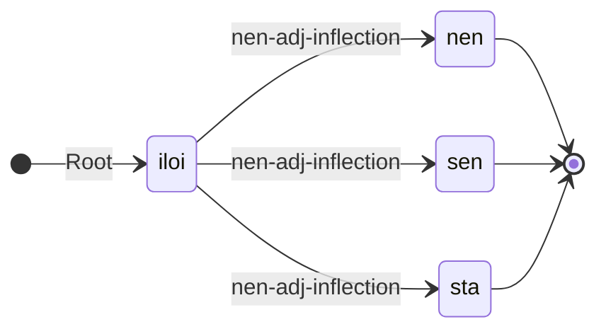

---
# try also 'default' to start simple
theme: default
# random image from a curated Unsplash collection by Anthony
# like them? see <https://unsplash.com/collections/94734566/slidev>
background: uit_bakgrunn.png
# apply any windi css classes to the current slide
class: 'text-center'
# https://sli.dev/custom/highlighters.html
highlighter: shiki
# show line numbers in code blocks
lineNumbers: false
# some information about the slides, markdown enabled
info: |
  ## Slidev Starter Template
  Presentation slides for developers.

  Learn more at [Sli.dev](https://sli.dev)
# persist drawings in exports and build
drawings:
  persist: false
title: "Fengande tittel"
---

# Fengande tittel

Den eg er <br/>
The Divvun Group, UiT

---

Presentation plan:

<br/>
<br/>

<Toc columns="2" maxDepth="1"/>

---
layout: section
---

# Introduction

---

## Demo presentation

<br/>
<br/>

<v-clicks>

* To show off
* … what's possible
* … using Markdown and a bit of CSS, JS, etc

</v-clicks>

---

## About me

<br/>
<br/>

<v-clicks>

* Me name
* Me education
* Me experience

</v-clicks>

---
layout: two-cols
---

### Example of long-lasting language technology

<br/>
Example of image with attribution:


::right::

Bilete av <a href="//commons.wikimedia.org/wiki/User:Berig" title="User:Berig">Berig</a>, <a href="https://creativecommons.org/licenses/by/2.5" title="Creative Commons Attribution 2.5">CC BY 2.5</a>, <a href="https://commons.wikimedia.org/w/index.php?curid=2287417">lenke til original</a>

Runesteinskatalogisering, med tekst, transkripsjon og omsetjing (på steinen: nedanfrå og opp på venstre side fyrst, deretter på høgre side:

> [Lingsbergsteinen](http://www.christerhamp.se/runor/gamla/u1/u240.html) i Sverige, katalogisert som «U 240», ca 1040
>
> <br/>
>
> ᛏᛅᚾ ᛅᚢᚴ ᚼᚢᛋ(ᚴ)ᛅᚱᛚ ᛭ ᛅᚢᚴ ᛋᚢᛁᛅᚾ ᛭ ᛅᚢᚴ ᚼᚢᛚᛘᚠᚱᛁᚦᚱ ᛭ ᚦᛅᚢᚾ ᛘᛁᚦᚴᛁᚾ ᛚᛁᛏᚢ ᚱᛁᛏᛅ ᛋᛏᛁᚿ ᚦᛁᚿᚭ ᛭ ᛆᚠᛏᛁᛦ ᚼᛅᛚᚠᛏᛆᚿ ᛭ ᚠᛆᚦᚢᚱ ᚦᛆᛁᛦᛆ ᛐᛆᚿᛋ ᛅᚢᚴ ᚼᚢᛘᚠᚱᛁᚦᚱ ᛅᛏ ᛒᚢᛆᚿᛏᛆ ᛋᛁᚿ
>
> <br/>
>
> «tan auk hus(k)arl + auk suain + auk hulmfriþr × þaun (m)(i)(þ)kin litu rita stin þino × aftiR halftan + fa(þ)ur þaiRa tans ' auk hum(f)riþr at buanta sin»
>
> <br/>
>
> «Dan och Húskarl och Sveinn och Holmfríð, modern och (hennes) söner, uppförde denna sten till minne av Halfdan, fadern till Dan och hans bröder; och Holmfríð till minne av sin man»

Transkripsjon som Ruby-tekst:
<ruby>ᛏᛅᚾ<rt><ruby>tan<rt>Dan</rt></ruby></rt></ruby> 
<ruby>ᛅᚢᚴ<rt><ruby>auk<rt>och</rt></ruby></rt></ruby> 
<ruby>ᚼᚢᛋ(ᚴ)ᛅᚱᛚ<rt><ruby>hus(k)arl<rt>Húskarl</rt></ruby></rt></ruby>

---

## Basic working of rule-based technologies


---
layout: section
---

# The GiellaLT infrastructure

---

## Standardised dir structure

```
.
├── devtools
├── docs
├── src
│   ├── cg3
│   ├── filters
│   ├── fst
│   ├── hyphenation
│   ├── orthography
│   ├── phonetics
│   ├── scripts
│   ├── tagsets
│   └── transcriptions
├── test
│   ├── data
│   ├── src
│   └── tools
└── tools
    ├── analysers
    ├── grammarcheckers
    ├── hyphenators
    ├── mt
    ├── shellscripts
    ├── spellcheckers
    └── tokenisers
```

---
layout: section
---

# Linguistic programming

---
layout: two-cols
---
## LexC

<br/>
<br/>

<v-clicks>

* excellent for concatenative morphology
* specify stems and affixes in different lexicons
    * abstractions over stem classes and inflections
* a programming language for linguists
* ... where you spell out the morphology of a language such that a compiler can
  turn it into an executable program

</v-clicks>

<v-clicks>

```
LEXICON Root
  iloinen:iloi nen-adj-inflection ;

LEXICON nen-adj-inflection
  +A+Sg+Nom:nen # ;
  +A+Sg+Gen:sen # ;
  +A+Sg+Par:sta # ;
```

</v-clicks>

::right::

<br/>
<br/>
<br/>
<br/>
<br/>
<br/>
<br/>
<br/>

<div v-after>

The same as a state diagram (diagram generated from text description using [Mermaid](https://mermaid.js.org)):



</div>

---

## Testing

Systematic testing is essential, and the infrastructure supports several types of tests:

* classes of words/inflections/alternations
* lemmas
* in-source test data

Example test data (South Sámi):

```
Tests:

  Verb - båetedh: # verb I, stem -ie, root vowel -åe-
    båetedh+V+IV+Inf: båetedh
    båetedh+V+IV+Ind+Prs+Sg1: båatam
    båetedh+V+IV+Ind+Prs+Sg2: båatah
    båetedh+V+IV+Ind+Prs+Sg3: båata
    båetedh+V+IV+Ind+Prs+Du1: båetien
    båetedh+V+IV+Ind+Prs+Du2: [båeteden, båetiejidien]
    båetedh+V+IV+Ind+Prs+Du3: båetiejægan
    båetedh+V+IV+Ind+Prs+Pl1: [båetebe, båetiejibie]
    båetedh+V+IV+Ind+Prs+Pl2: [båetede, båetiejidie]
    båetedh+V+IV+Ind+Prs+Pl3: båetieh
```

<!-- This can be used both as a development gold standard, and as regression testing later. -->

---
layout: section
---

# Tools

---

## Keyboards (desktop & mobile)

A very simple syntax (mobile keyboard shown):

```yaml
modes:
  mobile-default: |
    á š e r t y u i o p ŋ
    a s d f g h j k l đ ŧ
       ž z č c v b n m
  mobile-shift: |
    Á Š E R T Y U I O P Ŋ
    A S D F G H J K L Đ Ŧ
       Ž Z Č C V B N M
```

This + a few more technical details is used to produce ready-to-use installers and keyboard apps.

One can also add a speller file (fst-based spell checker), and get spelling correction as part of your mobile keyboard.

---
layout: two-cols
---

### Locale registration

As part of desktop keyboard installers, the locale <br/>
of the keyboard is added to Windows:

<v-click>


</v-click>

::right::

<br/>

<v-clicks>

Languages unknown to Windows is subsequently known and can be used for spell checking:


</v-clicks>

---
layout: center
---

### Grammar checker flow chart


---

## Text-to-speech (TTS)

<br/>
<br/>

<v-clicks>

* Commercial, closed source since 2014 — North Sámi
* Working on open source solution based on HFST, VislCG and ML - Lule and North Sámi
* similar pipeline to the grammar checker to make «phonemic» IPA
* feeding that to the synthesis engine
* synthesis done using machine learning / neural nets
* 10 hours of recordings should be enough for high quality synthesis

</v-clicks>

<div v-after>

Test sample, North Sámi, 5h recordings:

> Lea maid dehálaš ahte juohkehaš beassá ieš mearridit maid hupmá, go buohkat eai soaitte háliidit hupmat dan birra, ja dan galgá maid dohkkehit, lohká son.

<audio controls="controls">
  <source type="audio/wav" src="/0002_Lea-mai_FP_1000_M_univnet_nrate.wav"/>
  <p>Your browser does not support the audio element.</p>
</audio>

</div>

---
layout: end
---
